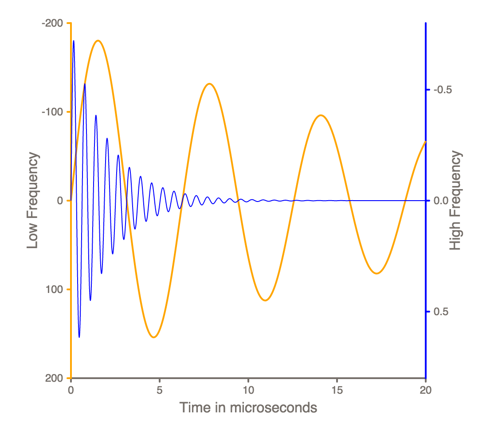

Victory Dual Axis Example
=========================

This is a quick example component that demonstrates composing victory components. It relies on [VictoryAxis](https://github.com/formidablelabs/victory-axis) and [VictoryLine](https://github.com/formidablelabs/victory-line)

Code lives in `demo/app.jsx`, and can be run like so:

```
npm install
npm run dev
```

The server runs on `localhost:3000`

The component renders:


* This example is not original, it is based on an example implemented in Matlab. You can see the original [here](http://blogs.mathworks.com/loren/2013/03/27/multiple-y-axes/)

p.s. You might notice that there's a lot of code hanging around here. That's because this project was started with a generator. [Check it out](https://github.com/formidablelabs/generator-formidable-react-component) It's overkill for this example, but it's all pretty handy if you need to write and test a real react component.


